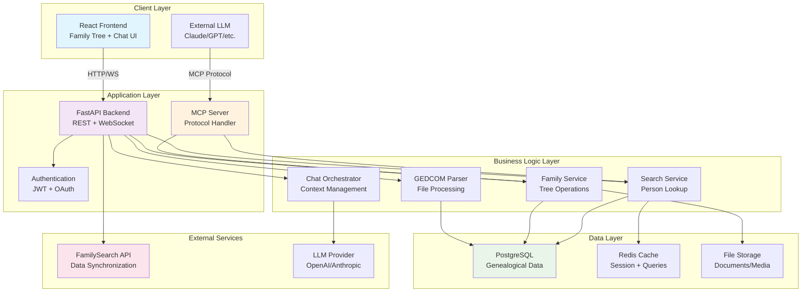
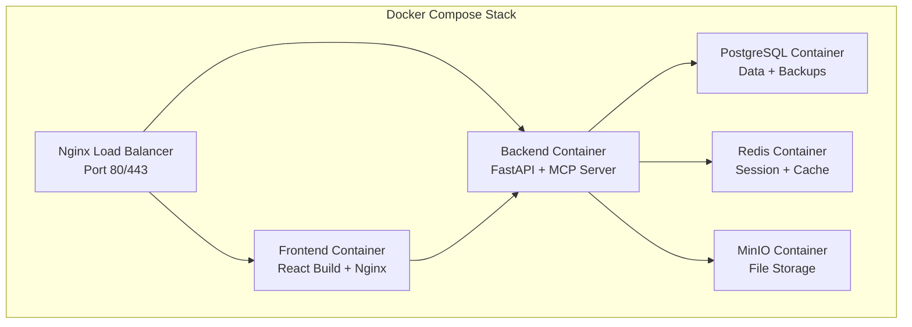

# High-Level Architecture - TreeChat

## Overview

TreeChat is an innovative genealogical server based on the MCP (Model Context Protocol) that enables natural language interaction with family history data. The architecture follows a modern three-tier approach with clear separation of concerns, emphasizing scalability, maintainability, and extensibility.

## Architecture Principles

- **MCP-First Design**: Built around the Model Context Protocol for seamless LLM integration
- **Data-Centric**: PostgreSQL as the single source of truth for all genealogical data
- **Microservices-Ready**: Modular backend components for easy scaling and maintenance
- **Security by Design**: Authentication, authorization, and data privacy at every layer
- **Docker-Native**: Container-first deployment strategy

## Global Architecture



## Core Components

### 1. React Frontend
**Purpose**: User interface for data management and conversational interaction

**Features**:
- Interactive family tree visualization with D3.js
- GEDCOM file upload with progress tracking
- Real-time chat interface with conversation history
- Person search with autocomplete and filtering
- Data source management dashboard

**Technology Stack**:
- React 18+ with functional components and hooks
- D3.js for family tree visualization
- Axios for API communication
- WebSocket for real-time chat

### 2. FastAPI Backend
**Purpose**: Main application server handling business logic and API endpoints

**Key Modules**:
- **Authentication Module**: JWT token management, OAuth integration
- **Import Module**: GEDCOM file processing and validation
- **Family Module**: Tree traversal, relationship calculations
- **Search Module**: Person and family lookup with caching
- **Chat Module**: Conversation orchestration and context management

**API Endpoints**:
```
POST /api/auth/login
POST /api/import/gedcom
GET /api/persons
GET /api/persons/{id}/family-tree
GET /api/search/persons?q={query}
POST /api/chat/message
WebSocket /ws/chat
```

### 3. MCP Server
**Purpose**: Expose genealogical data to external LLMs via Model Context Protocol

**MCP Tools Exposed**:
- `search_person`: Find individuals by name, date, or place
- `get_family_tree`: Retrieve family relationships for a person
- `get_person_details`: Get comprehensive person information
- `find_ancestors`: Get ancestral lineage
- `find_descendants`: Get descendant lineage
- `get_family_statistics`: Generate family tree statistics

**Security**: Token-based authentication for external LLM access

### 4. PostgreSQL Database
**Purpose**: Centralized storage for all genealogical data with optimized schema

**Core Tables**:
- `persons`: Individual records with biographical data
- `relationships`: Family connections (parent/child, spouse)
- `events`: Life events (birth, marriage, death, etc.)
- `sources`: Data provenance (GEDCOM files, FamilySearch)
- `places`: Geographical locations with standardization
- `families`: Family units for complex relationships

**Indexing Strategy**:
- B-tree indexes on names, dates, places
- Full-text search indexes for biographical data
- Composite indexes for relationship queries

### 5. Business Services

#### GEDCOM Parser Service
- Handles multiple GEDCOM format variations
- Validates data integrity before import
- Maps GEDCOM tags to database schema
- Supports incremental imports and updates
- Error reporting and data quality assessment

#### Family Tree Service
- Calculates relationship degrees and paths
- Generates tree visualizations data
- Handles complex family structures (adoptions, multiple marriages)
- Optimized queries for large family trees
- Ancestor/descendant path finding algorithms

#### Search Service
- Full-text search across person data
- Phonetic name matching (Soundex, Metaphone)
- Date range and location-based filtering
- Redis caching for frequent searches
- Autocomplete and suggestion engine

## Data Flow Patterns

### 1. GEDCOM Import Flow
```
File Upload → Validation → Parsing → Schema Mapping → Database Insert → Index Update
```

### 2. Chat Interaction Flow
```
User Query → Context Assembly → MCP Tool Selection → Database Query → LLM Processing → Response Generation
```

### 3. Family Tree Visualization Flow
```
Person Selection → Relationship Query → Graph Generation → Frontend Rendering → Interactive Updates
```

## Deployment Architecture

### Container Strategy


### Environment Configuration
- **Development**: Single-node Docker Compose
- **Production**: Kubernetes with horizontal pod autoscaling
- **Security**: TLS termination, secret management, network policies

## Technical Specifications

### Performance Requirements
- **Response Time**: < 200ms for API calls, < 2s for complex family tree queries
- **Throughput**: Support 100 concurrent users, 1000 requests/minute
- **Data Scale**: Handle family trees with 10,000+ individuals
- **Storage**: Efficient storage for large GEDCOM files (>100MB)

### Security Measures
- **Authentication**: JWT tokens with refresh mechanism
- **Authorization**: Role-based access control (RBAC)
- **Data Privacy**: GDPR compliance, data anonymization options
- **API Security**: Rate limiting, input validation, CORS policies
- **Infrastructure**: Container security scanning, secrets management

### Scalability Considerations
- **Horizontal Scaling**: Stateless backend design for load balancing
- **Database Optimization**: Read replicas for query distribution
- **Caching Strategy**: Multi-level caching (application, database, CDN)
- **File Storage**: Object storage for media and document files

## Integration Points

### FamilySearch API Integration
- OAuth 2.0 authentication flow
- Incremental data synchronization
- Rate limit handling and backoff strategies
- Data mapping and conflict resolution

### External LLM Integration
- MCP protocol implementation
- Context window optimization
- Response streaming for real-time chat
- Multiple LLM provider support (OpenAI, Anthropic, local models)

## Risk Assessment and Mitigations

### Identified Risks
1. **GEDCOM Complexity**: Varied formats and data quality issues
   - *Mitigation*: Robust parsing with error recovery and validation
   
2. **Large Dataset Performance**: Slow queries on extensive family trees
   - *Mitigation*: Optimized indexing, query optimization, caching layers
   
3. **Data Privacy**: Handling sensitive genealogical information
   - *Mitigation*: Encryption at rest/transit, access controls, audit logging
   
4. **External API Dependencies**: FamilySearch rate limits and downtime
   - *Mitigation*: Retry mechanisms, graceful degradation, local caching

### Success Metrics
- **User Engagement**: Chat interactions per session, time spent exploring
- **Data Quality**: Successfully imported GEDCOM files, data completeness
- **Performance**: API response times, family tree loading speed
- **Reliability**: System uptime, error rates, data consistency

## Future Evolution

### Extensibility Points
- **Plugin Architecture**: Custom data importers and exporters
- **Multiple LLMs**: Support for various AI providers and local models
- **Advanced Visualizations**: Timeline views, geographic maps, DNA integration
- **Collaboration Features**: Shared family trees, collaborative editing
- **Mobile Support**: Progressive Web App (PWA) capabilities

This architecture provides a solid foundation for TreeChat while maintaining flexibility for future enhancements and scaling requirements.