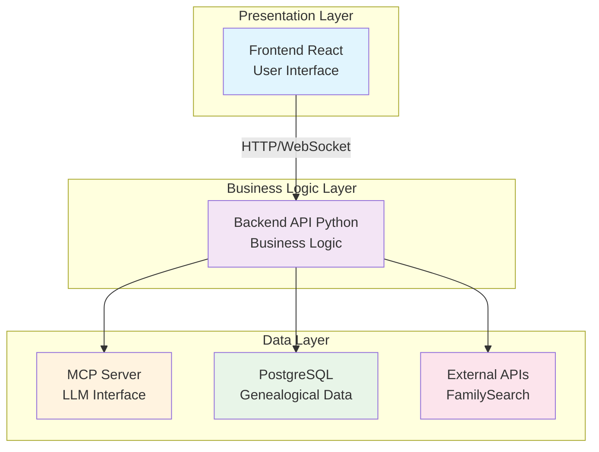
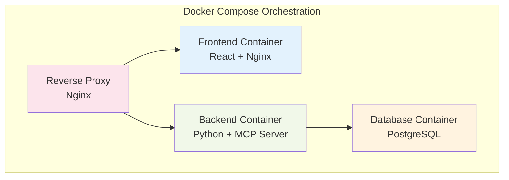

# High-Level Architecture - TreeChat

## Overview

TreeChat is a genealogical server based on the MCP protocol that allows users to interact with their family data through a conversational interface. The architecture relies on a modular approach with clear separation between data layers, business logic, and presentation.

## Global Architecture



## Main Components

### 1. Frontend (React + JavaScript)
- **Main user interface** with two distinct sections:
  - **Data Management Section**: GEDCOM import, FamilySearch configuration
  - **Chat Section**: ChatGPT-like conversational interface
- **Responsibilities**:
  - User interface management
  - Backend API communication
  - Genealogical tree visualization
  - Real-time chat interface

### 2. Backend API (Python)
- **Main server** exposing REST and WebSocket APIs
- **Functional modules**:
  - **Import module**: GEDCOM file processing
  - **Integration module**: FamilySearch API connectivity
  - **Data module**: Genealogical entities management
  - **MCP module**: Internal MCP server
  - **Chat module**: Conversation orchestration
- **Responsibilities**:
  - Application business logic
  - Data validation and transformation
  - Authentication and authorization management
  - MCP server exposition

### 3. PostgreSQL Database
- **Relational schema** optimized for genealogical data:
  - **Persons**: Identities, dates, places
  - **Relations**: Family links (parent/child, marriage)
  - **Sources**: Data provenance (GEDCOM, FamilySearch)
  - **Events**: Births, marriages, deaths
- **Responsibilities**:
  - Persistent data storage
  - Complex genealogical tree queries
  - Referential integrity

### 4. Internal MCP Server
- **MCP protocol** for communication with external LLMs
- **Specialized endpoints**:
  - Person search
  - Tree navigation
  - Family context extraction
- **Responsibilities**:
  - Standardized LLM interface
  - Data contextualization for AI
  - Conversational query management

### 5. External Integrations
- **FamilySearch API**:
  - OAuth authentication
  - Data synchronization
  - Incremental updates

## Data Flows

### 1. GEDCOM Data Import
```
User → Frontend → Backend → GEDCOM Parser → PostgreSQL
```

### 2. FamilySearch Synchronization
```
OAuth Config → FamilySearch API → Backend → Transformation → PostgreSQL
```

### 3. Chat Session
```
Question → Frontend → Backend → MCP Server → LLM → Contextual Response
```

## Docker Deployment

### Deployment Architecture


### Containers
- **treechat-frontend**: Built React application, served by Nginx
- **treechat-backend**: Python API with integrated MCP server
- **treechat-db**: PostgreSQL with initialized schema
- **treechat-proxy**: Reverse proxy for routing and SSL

## Technical Considerations

### Security
- JWT authentication for backend API
- OAuth token encryption for FamilySearch
- Strict input data validation
- Docker container isolation

### Performance
- Optimized indexing on family relations
- In-memory cache for frequent queries
- Pagination for large families
- PostgreSQL connection pooling

### Scalability
- Stateless backend architecture
- Separation of concerns by modules
- Externalized configuration via environment variables
- Centralized monitoring and logging

### Extensibility
- Standardized MCP interface for new LLMs
- Modular architecture for new data sources
- Documented REST API for third-party integrations
- Flexible database schema for future evolution

## Key Considerations

### Identified Risks
- **GEDCOM data complexity**: Format variability
- **FamilySearch API limits**: Quotas and rate limiting
- **Large tree performance**: Complex query optimization
- **Personal data security**: GDPR compliance

### Mitigations
- Robust GEDCOM parser with error handling
- Retry system and cache for external API
- Indexing strategies and optimized queries
- Sensitive data encryption and audits