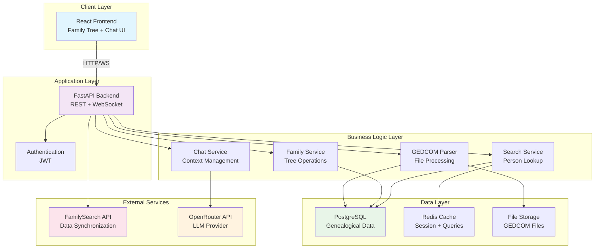
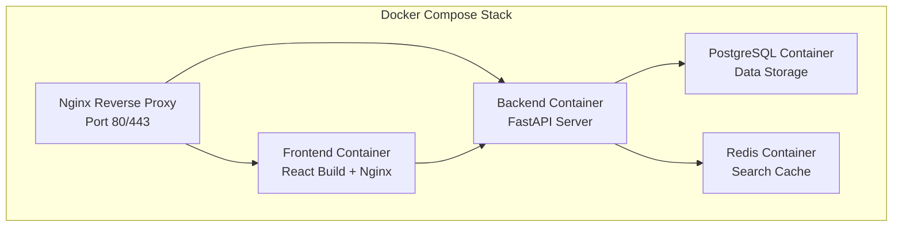

# High-Level Architecture - TreeChat MVP

## Overview

TreeChat is an innovative genealogical application that enables natural language interaction with family history data. This MVP architecture follows a simplified three-tier approach focusing on core functionality: GEDCOM import, family tree visualization, and chat-based exploration using OpenRouter API.

## Architecture Principles

- **MVP-First Design**: Simplified architecture focusing on core features
- **Data-Centric**: PostgreSQL as the single source of truth for all genealogical data
- **Direct LLM Integration**: OpenRouter API for chat functionality without MCP complexity
- **Modular Backend**: Clean separation of concerns for future extensibility
- **Docker-Native**: Container-first deployment strategy

## Global Architecture



## Core Components

### 1. React Frontend
**Purpose**: User interface for data management and conversational interaction

**Features**:
- Interactive family tree visualization with D3.js
- GEDCOM file upload with progress tracking
- Real-time chat interface with conversation history
- Person search with autocomplete and filtering
- Data source management dashboard

**Technology Stack**:
- React 18+ with functional components and hooks
- D3.js for family tree visualization
- Axios for API communication
- WebSocket for real-time chat

**Key Components**:
```
src/
├── components/
│   ├── FamilyTree.js       # D3.js tree visualization
│   ├── Chat.js             # Chat interface
│   ├── PersonSearch.js     # Search functionality
│   ├── DataManagement.js   # GEDCOM upload & sources
│   └── PersonDetails.js    # Individual person view
├── services/
│   ├── api.js             # Backend API calls
│   └── websocket.js       # Chat WebSocket
└── utils/
    └── treeLayout.js      # Tree visualization helpers
```

### 2. FastAPI Backend
**Purpose**: Main application server handling business logic and API endpoints

**Key Modules**:
- **Authentication Module**: JWT token management
- **Import Module**: GEDCOM file processing and validation
- **Family Module**: Tree traversal, relationship calculations
- **Search Module**: Person and family lookup with caching
- **Chat Module**: OpenRouter API integration and context management
- **FamilySearch Module**: External API integration

**API Endpoints**:
```
Authentication:
POST /api/auth/login
POST /api/auth/logout

Data Import:
POST /api/import/gedcom
GET /api/import/status/{task_id}

Family Data:
GET /api/persons
GET /api/persons/{id}
GET /api/persons/{id}/family-tree
GET /api/persons/{id}/ancestors
GET /api/persons/{id}/descendants

Search:
GET /api/search/persons?q={query}
GET /api/search/suggest?q={partial}

Chat:
POST /api/chat/message
WebSocket /ws/chat/{session_id}

Data Sources:
GET /api/sources
POST /api/sources/familysearch/auth
GET /api/sources/familysearch/sync
```

**Project Structure**:
```
app/
├── main.py                 # FastAPI application
├── models/
│   ├── person.py          # SQLAlchemy models
│   ├── relationship.py
│   └── source.py
├── services/
│   ├── gedcom_parser.py   # GEDCOM processing
│   ├── family_service.py  # Tree operations
│   ├── search_service.py  # Search functionality
│   ├── chat_service.py    # OpenRouter integration
│   └── familysearch.py    # FamilySearch API
├── routes/
│   ├── auth.py           # Authentication endpoints
│   ├── persons.py        # Person management
│   ├── import.py         # Data import
│   ├── chat.py           # Chat endpoints
│   └── sources.py        # External sources
└── utils/
    ├── database.py       # DB connection
    └── security.py       # JWT utilities
```

### 3. PostgreSQL Database
**Purpose**: Centralized storage for all genealogical data with optimized schema

**Core Tables**:
- `sources`: Data source tracking (GEDCOM files, FamilySearch)
- `persons`: Individual records with biographical data
- `relationships`: Family connections (parent/child, spouse)
- `events`: Life events (birth, marriage, death, etc.)
- `places`: Geographical locations with standardization
- `chat_sessions`: Chat conversation history

**Schema Design**:
```sql
-- Core genealogical entities
CREATE TABLE sources (
    id UUID PRIMARY KEY,
    name VARCHAR(255),
    type VARCHAR(50), -- 'gedcom', 'familysearch'
    imported_at TIMESTAMP,
    status VARCHAR(50)
);

CREATE TABLE persons (
    id UUID PRIMARY KEY,
    source_id UUID REFERENCES sources(id),
    gedcom_id VARCHAR(255), -- Original GEDCOM ID
    name VARCHAR(255),
    given_names TEXT,
    surname VARCHAR(255),
    gender CHAR(1),
    birth_date DATE,
    birth_place VARCHAR(255),
    death_date DATE,
    death_place VARCHAR(255),
    is_living BOOLEAN DEFAULT false,
    created_at TIMESTAMP,
    updated_at TIMESTAMP
);

CREATE TABLE relationships (
    id UUID PRIMARY KEY,
    person1_id UUID REFERENCES persons(id),
    person2_id UUID REFERENCES persons(id),
    relationship_type VARCHAR(50), -- 'child', 'spouse', 'parent'
    created_at TIMESTAMP
);
```

**Indexing Strategy**:
- B-tree indexes on names, dates, places
- Full-text search indexes for biographical data
- Composite indexes for relationship queries
- Foreign key indexes for joins

### 4. Business Services

#### GEDCOM Parser Service
**Purpose**: Process and import GEDCOM files into PostgreSQL

**Features**:
- Handles GEDCOM 5.5 format variations
- Validates data integrity before import
- Maps GEDCOM tags to database schema
- Supports multiple GEDCOM imports in same database
- Async processing with status tracking

**Key Functions**:
```python
async def parse_gedcom_file(file_path: str, source_id: UUID) -> ImportResult
async def validate_gedcom_data(gedcom_data: dict) -> ValidationResult
async def import_persons(persons_data: list, source_id: UUID) -> list[UUID]
async def import_relationships(relationships_data: list) -> None
```

#### Family Tree Service
**Purpose**: Generate family tree data for visualization

**Features**:
- Calculates relationship degrees and paths
- Generates tree visualization data structures
- Handles complex family structures
- Optimized queries for large family trees
- Ancestor/descendant path finding

**Key Functions**:
```python
async def get_family_tree(person_id: UUID, generations: int = 3) -> TreeData
async def find_relationship_path(person1_id: UUID, person2_id: UUID) -> Path
async def get_ancestors(person_id: UUID, generations: int = 5) -> list[Person]
async def get_descendants(person_id: UUID, generations: int = 5) -> list[Person]
```

#### Search Service
**Purpose**: Fast person and family search capabilities

**Features**:
- Full-text search across person data
- Phonetic name matching (Soundex)
- Date range and location filtering
- Redis caching for frequent searches
- Autocomplete suggestions

#### Chat Service
**Purpose**: Handle conversational queries using OpenRouter API

**Features**:
- Context assembly from family data
- OpenRouter API integration
- Conversation history management
- Response streaming
- Source citation in responses

**OpenRouter Integration**:
```python
class ChatService:
    async def send_query(self, message: str, person_context: Person = None) -> ChatResponse:
        context = await self._build_context(person_context)
        response = await self.openrouter_client.chat_completion(
            messages=[
                {"role": "system", "content": self._build_system_prompt(context)},
                {"role": "user", "content": message}
            ]
        )
        return self._process_response(response)
```

## Data Flow Patterns

### 1. GEDCOM Import Flow
```
File Upload → Validation → Background Processing → Database Import → Status Updates → Completion Notification
```

### 2. Chat Interaction Flow
```
User Query → Context Assembly → Person Data Retrieval → OpenRouter API Call → Response Processing → Citation Addition
```

### 3. Family Tree Visualization Flow
```
Person Selection → Relationship Queries → Tree Data Generation → Frontend Rendering → Interactive Updates
```

## MVP Deployment Architecture

### Docker Container Strategy


### Container Specifications

**Frontend Container (treechat-frontend)**:
- Base: node:18-alpine for build, nginx:alpine for serving
- Build React application
- Serve static files via Nginx
- Environment-specific configuration

**Backend Container (treechat-backend)**:
- Base: python:3.11-slim
- FastAPI with uvicorn server
- Background task processing with Celery
- Environment variables for configuration

**Database Container (treechat-db)**:
- Base: postgres:15
- Persistent volume for data
- Initialization scripts for schema
- Backup and restore capabilities

**Cache Container (treechat-cache)**:
- Base: redis:7-alpine
- Session storage and search caching
- Persistent volume for durability

### Environment Configuration
```yaml
# docker-compose.yml structure
version: '3.8'
services:
  frontend:
    build: ./frontend
    ports: ["3000:80"]
    depends_on: [backend]
    
  backend:
    build: ./backend
    ports: ["8000:8000"]
    environment:
      - DATABASE_URL=postgresql://user:pass@db:5432/treechat
      - REDIS_URL=redis://cache:6379/0
      - OPENROUTER_API_KEY=${OPENROUTER_API_KEY}
      - FAMILYSEARCH_CLIENT_ID=${FAMILYSEARCH_CLIENT_ID}
    depends_on: [db, cache]
    
  db:
    image: postgres:15
    environment:
      - POSTGRES_DB=treechat
      - POSTGRES_USER=treechat
      - POSTGRES_PASSWORD=${DB_PASSWORD}
    volumes: ["./data/postgres:/var/lib/postgresql/data"]
    
  cache:
    image: redis:7-alpine
    volumes: ["./data/redis:/data"]
```

## Technical Specifications

### Performance Requirements
- **API Response Time**: < 300ms for standard queries
- **Family Tree Loading**: < 2s for trees up to 1000 persons
- **Chat Response**: < 5s including OpenRouter API call
- **GEDCOM Import**: Support files up to 50MB with progress tracking

### Security Measures
- **Authentication**: JWT tokens with 24h expiration
- **API Security**: Rate limiting, input validation, CORS policies
- **Data Privacy**: GDPR-compliant data handling
- **File Security**: Virus scanning for uploaded GEDCOM files
- **External APIs**: Secure credential storage for FamilySearch/OpenRouter

### Scalability Considerations (Post-MVP)
- **Horizontal Scaling**: Stateless backend design
- **Database Optimization**: Connection pooling, read replicas
- **Caching**: Multi-level caching strategy
- **File Storage**: Object storage migration path

## External Integrations

### OpenRouter API Integration
**Purpose**: LLM functionality for chat interface

**Implementation**:
- Direct HTTP API calls to OpenRouter endpoints
- Context window optimization for family data
- Response streaming for real-time experience
- Error handling and fallback responses
- Usage tracking and cost monitoring

**Context Assembly**:
```python
def build_family_context(person: Person, family_members: list[Person]) -> str:
    context = f"""
    You are helping explore the family history of {person.name}.
    
    Person Details:
    - Name: {person.name}
    - Birth: {person.birth_date} in {person.birth_place}
    - Death: {person.death_date or 'Living'} {person.death_place or ''}
    
    Related Family Members:
    {format_family_members(family_members)}
    
    Please provide accurate information based only on this data.
    """
    return context
```

### FamilySearch API Integration
**Purpose**: External genealogical data synchronization

**Implementation**:
- OAuth 2.0 authentication flow
- Incremental data synchronization
- Rate limit handling with exponential backoff
- Data mapping from FamilySearch to local schema
- Conflict resolution for duplicate data

## MVP Success Criteria

### Core Features (Must Have)
1. **GEDCOM Import**: Successfully parse and import standard GEDCOM files
2. **Family Tree Visualization**: Interactive D3.js tree with zoom/pan capabilities
3. **Person Search**: Fast search across imported family data
4. **Chat Interface**: Natural language queries using OpenRouter API
5. **Docker Deployment**: Single-command deployment with docker-compose

### Success Metrics
- **Data Import**: 95% success rate for standard GEDCOM files
- **User Experience**: < 3s average page load time
- **Chat Quality**: Relevant responses based on family data context
- **Deployment**: < 5 minute setup time from code to running application

### Post-MVP Evolution Path
1. **Enhanced Chat**: Better context management, conversation memory
2. **Advanced Visualization**: Timeline views, geographic mapping
3. **Collaboration**: Multi-user family trees, sharing capabilities
4. **Mobile Support**: Progressive Web App implementation
5. **External Integrations**: Additional genealogy service APIs

This MVP architecture provides a solid foundation for TreeChat while maintaining simplicity and focus on core user value.